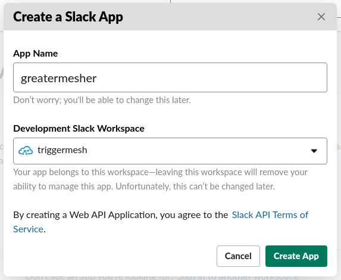
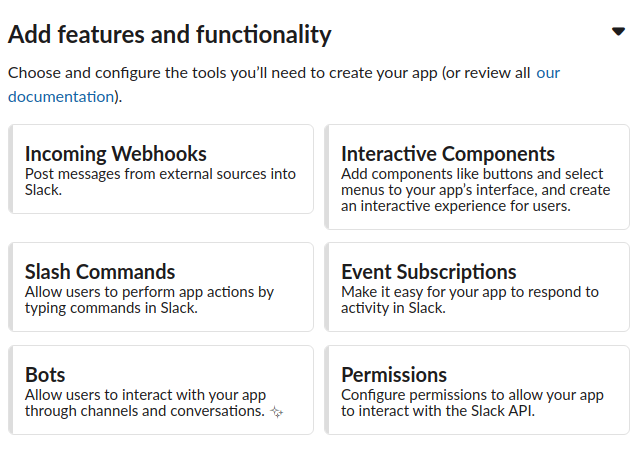
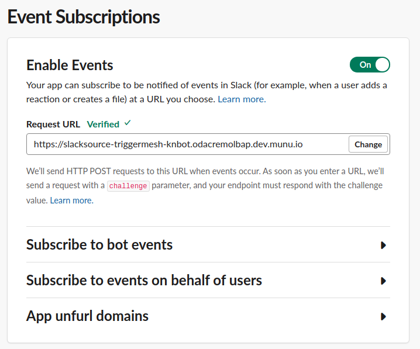
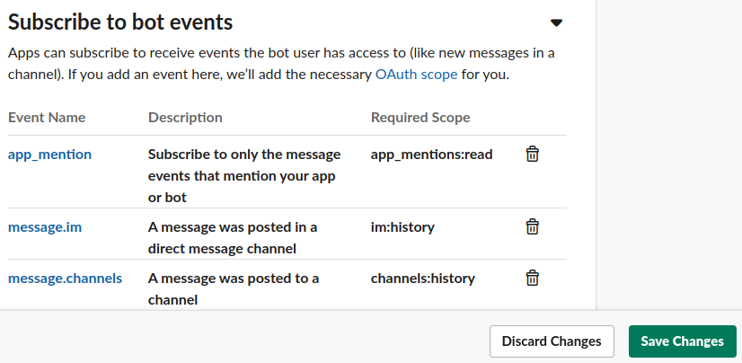
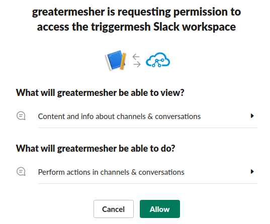
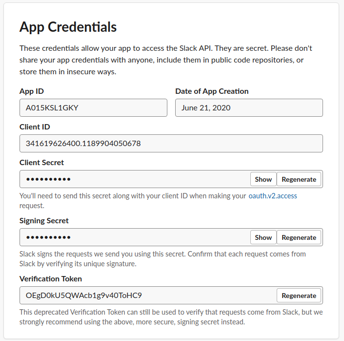

# Slack Source for Knative

Slack Source enables integration between slack messages using the Events API and Knative Eventing.

## Contents
- [Slack Source for Knative](#slack-source-for-knative)
  - [Contents](#contents)
  - [Building](#building)
  - [Deploy controller](#deploy-controller)
    - [Deploy Slack Source Controller](#deploy-slack-source-controller)
  - [Create Slack Integration](#create-slack-integration)
    - [Deploy Slack Source](#deploy-slack-source)
    - [Configure Slack Events API App](#configure-slack-events-api-app)
    - [Secure the Slack Source](#secure-the-slack-source)
  - [Events](#events)
  - [Support](#support)

## Building

The entry point (`main` package) for the controller and target adapter are respectively under
`cmd/controller/` and `cmd/adapter/`. Both these programs can be built using
the Go toolchain:

```sh
$ make build
```

Binaries will be generated for your current OS and architecture inside the root repo `_output` thdirectory.

Those binaries can also be packaged as container images in order to run inside a Kubernetes cluster:

```sh
$ make image
```

All make targets can be listed:

```sh
$ make help
```

## Deploy controller

### Deploy Slack Source Controller

You can build and deploy your own images from source configuring [ko](https://github.com/google/ko) and executing from the Slack source folder:

```sh
ko apply -f ./config/
```

Alternatively you can base on the manifests at the config repo to build a set of kubernetes manifests that use your customized images and namespace.

## Create Slack Integration

Deploy the Slack source in 3 steps:

1. Deploy the Slack Source at the cluster, retieve exposed endpoint.
2. Configure Slack App to send events to the Slack Source endpoint.
3. (optional) Modify the Slack Source to add Signing Secret and AppID from the configured App.

### Deploy Slack Source

An instance of the Slack Source is created by applying a manifest that fullfills its CRD schema. Accepted Spec parameters are:

- `signingSecret` (optional), a kubernetes secret that holds the Signing Secret that verifies messages from the Slack App.
- `appID` (optional), to identify the Slack App when multiple integrations use the same endpoint.
- `sink`, the addressable where cloud events generated from this source will be sent. Refer to Knative's documentation.

Example:

```yaml
apiVersion: sources.triggermesh.io/v1alpha1
kind: SlackSource
metadata:
  name: triggermesh-knbot
  namespace: odacremolbap
spec:
  sink:
    ref:
      apiVersion: serving.knative.dev/v1
      kind: Service
      name: event-display
```

Once created wait for the source to be ready and take note of the URL (`status.address.url`):

``` sh
 kubectl get slacksource -n odacremolbap triggermesh-knbot
NAME                READY   REASON   URL                                                              SINK                                                  AGE
triggermesh-knbot   True             https://slacksource-triggermesh-knbot.odacremolbap.dev.munu.io   http://event-display.odacremolbap.svc.cluster.local   25h
```

### Configure Slack Events API App

1. Create a new Slack App at https://api.slack.com/apps

    

2. From Basic Information, Features and functionality, select `Event Subscriptions`

    

3. Slide the `Enable Events` selector to `on` and write the Slack Source exposed URL at the `Request URL` box. A request with a verification challenge will be sent and when the Slack Source adapter answer it will be validated and a green check will be shown.

    

4. At the `Subscribe to bot events` section select the bot events that will be sent on behalf of this integration and then press `Save Changes` at the bottom of the page.. Refer to Slack documentation on which ones to use, as a hint the we think these 3 could be useful for different scenarios:
   - `app_mention` will send an event when the App is mentioned.
   - `message.im` will send an event when sending a direct message to the App.
   - `message.channels` an event will be sent for each message at a channel where the App is invited.

    

5. At `Install App` section click on `Install App to Workspace`

    

6. (Optional)Return to the application's `Basic Information` and take note of `App ID` and `Signing Secret`

    

You will now have a working integration. Any Slack action that matches the configured event subscription will be sent to the Slack Source and from there to the sink.

### Secure the Slack Source

To secure the Slack Source edit the manifest to add `Signing Secret` as a kubernetes secret. The Application ID is not needed but can also be configured to make sure that the received events match the configured Application.

```yaml
apiVersion: sources.triggermesh.io/v1alpha1
kind: SlackSource
metadata:
  name: triggermesh-knbot
  namespace: odacremolbap
spec:
  signingSecret:
    secretKeyRef:
      name: slack
      key: signingSecret
  appID: A015KSL1GKY
  sink:
    ref:
      apiVersion: serving.knative.dev/v1
      kind: Service
      name: event-display
```

## Events

The Slack Source creates a cloud event for each Slack Event sent on behalf of the integration. Slack events are wrapped in a structure that is used for CloudEvents categorization, while the [wrapped event](https://api.slack.com/types/event) is sent as the payload.

Cloud Event header example:

| CloudEvent  | Description   | Example             |
|---          |---            |---                  |
| type        | fixed value   | `com.slack.events`  |
| source      | Team ID (Slack workspace)   | `TA1J7JEBS`   |
| subject     | Event type   | `message`                    |
| time     | Event wrapper time   | `2020-06-21T09:44:35Z`  |
| id     | Event wrapper ID   | `Ev01656P5WP3`  |


Cloud Event data example:

```json
{
  "blocks": [
    {
      "block_id": "ws9ME",
      "elements": [
        {
          "elements": [
            {
              "text": "waving hello ",
              "type": "text"
            },
            {
              "type": "user",
              "user_id": "U015NKH6R6G"
            }
          ],
          "type": "rich_text_section"
        }
      ],
      "type": "rich_text"
    }
  ],
  "channel": "C01112A09FT",
  "channel_type": "channel",
  "client_msg_id": "9fc2ed3e-c823-4dcf-be6b-4d788ab0beea",
  "event_ts": "1592732675.009400",
  "team": "TA1J7JEBS",
  "text": "waving hello \u003c@U015NKH6R6G\u003e",
  "ts": "1592732675.009400",
  "type": "message",
  "user": "UT8LFLXR8"
}
```

## Support

This is heavily **Work In Progress** We would love your feedback on this
Operator so don't hesitate to let us know what is wrong and how we could improve
it, just file an [issue](https://github.com/triggermesh/knative-sources/issues/new)
