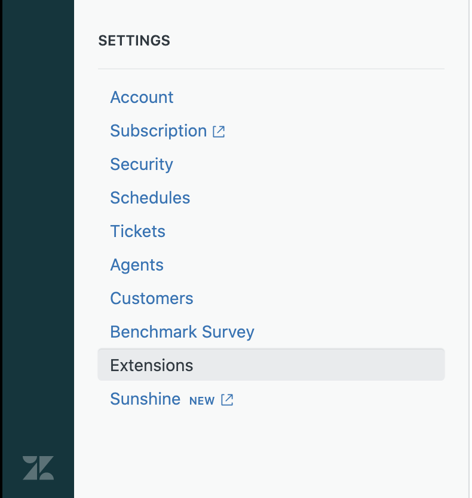
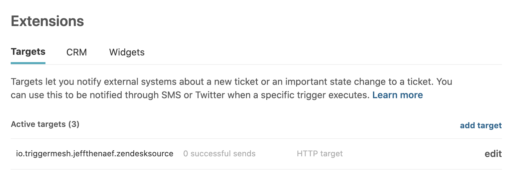
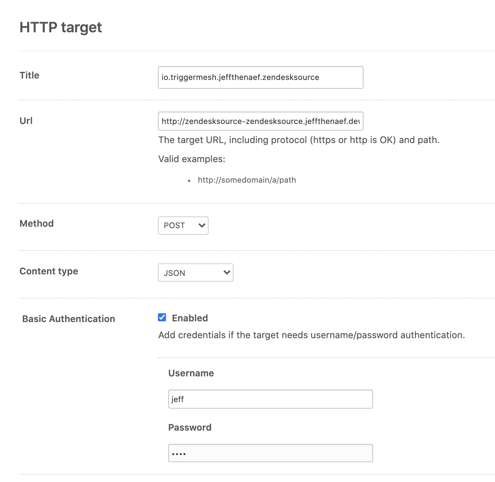
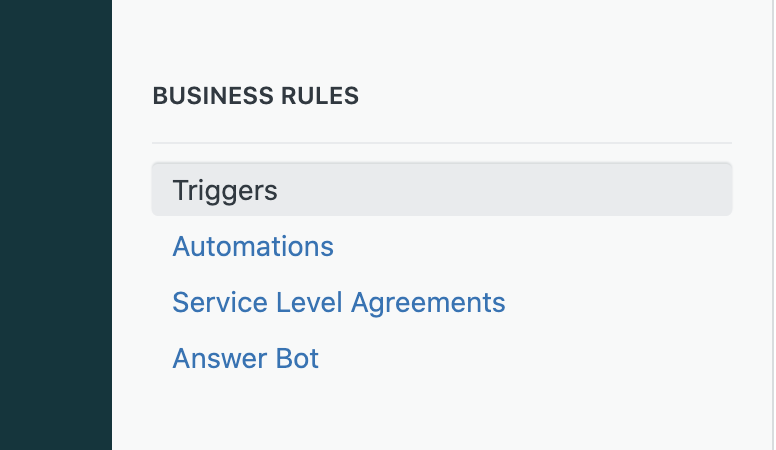
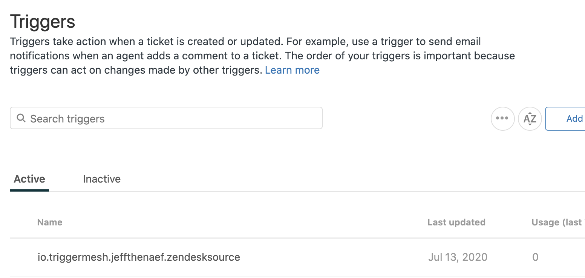
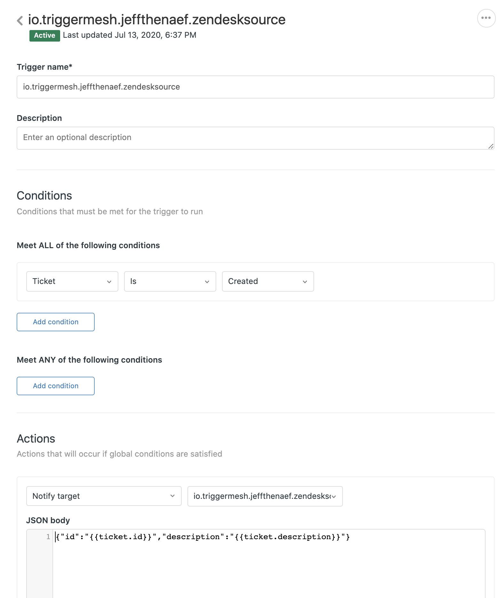

# Zendesk Source for Knative

Zendesk Source enables integration between zendesk messages using the Events API and Knative Eventing.

## Contents
- [Zendesk Source for Knative](#zendesk-source-for-knative)
  - [Contents](#contents)
  - [Building](#building)
  - [Deploy controller](#deploy-controller)
    - [Deploy Zendesk Source Controller](#deploy-zendesk-source-controller)
  - [Create Zendesk Integration](#create-zendesk-integration)
    - [Deploy Zendesk Source](#deploy-zendesk-source)
    - [Configure Zendesk Events API App](#configure-zendesk-events-api-app)
    - [Secure the Zendesk Source](#secure-the-zendesk-source)
  - [Events](#events)
  - [Support](#support)

## Building

###### The entry point (`main` package) for the controller and target adapter are under `cmd/controller/` and `cmd/adapter/,` respectively . Both these programs can be built using the Go toolchain from the `knative-sources/zendesk` directory

To create binaries for your current OS and architecture inside the root repo `_output` directory:
```sh
$ make build
```

To create container images:
```sh
$ make image
```
To list the other 'make' functions:
```sh
$ make help
```

## Deploying a Controller

### Deploying a Zendesk Source Controller From Code

[ko](https://github.com/google/ko) provides a quick method to build from source and apply the associated Kuberneties configurations.

```sh
$ ko apply -f ./config/
```

Alternatively you can base on the manifests at the config repo to build a set of kubernetes manifests that use your customized images and namespace.

### Deploy Zendesk Source

An instance of the Zendesk Source is created by applying a manifest that fullfills its CRD schema. Accepted and REQUIRED Spec parameters are:

- `email` : The email associated with a valid Zendesk account. 
- `username` : Used for basic authentication between Zendesk and the Source
- `subdomain` : The Zendesk Subdomain 

A Zendesk Source also REQUIRES that a secret `zendesksource` exists populated with a the following parameters:

- `token` : A Zendesk API token. 
- `password` : Used for basic authentication between Zendesk and the Source

*Note that `username` and `password` are _defined_ here and can hold arbitrary values. They are not coming from or are populated by any external service. These two parameters will be used while registering the webhook and then passed to the Source to use in the validation process of the Webhook 'POST' requests.*

Example Secret Deployment:
```yaml
apiVersion: v1
kind: Secret
metadata:
  name: zendesksource
type: Opaque
stringData:
  token: 'tHpUJ2ieiXsxEvBotczR99EwpETeQOiUU07KovBJ'
  password: 'Pa$$sw0rd'
```
Example Source Deployment:
```yaml
apiVersion: sources.triggermesh.io/v1alpha1
kind: ZendeskSource
metadata:
  name: zendesksource
spec:
  email: 'joe@autoparts.com '
  username: 'joe' 
  subdomain: 'autoparts'
  token:
            secretKeyRef:
              name: zendesksource
              key: token
  password:
            secretKeyRef:
              name: zendesksource
              key: password
  ref:
      apiVersion: serving.knative.dev/v1
      kind: Service
      name: event-display
```

Both of these files, along with an example source, exist in the `/zendesk/sample/` directory. After populating the required fields with valid information, and deploying the Controller, a Zendesk Source can now be deployed by execuing the following command in the `knative-sources/zendesk` directory:

```sh
kubectl -n autoPartsNamespace apply -f sample/
```


Once created wait for the source to be ready and take note of the URL (`status.address.url`):

``` sh
kubectl get zendesksource -n autoPartsNamespace zendesk-source

NAME                READY   REASON   URL                                                              SINK                                                  AGE
zendesksource       True             https://zendesksource-triggermesh.autoPartsNamespace.dev.munu.io      http://event-display.autoPartsNamespace.svc.cluster.local    25h
```
### Verify a Zendesk Source Deployment
One can verify a successful deployment of a Zendesk Source by  navigate to the `settings` sidebar of your Zendesk subdomain and selecting `Extensions`



A Zendesk Source will create a new `Extension` or `Target` with a Title of : "io.triggermesh." + The namespace it was deployed + The deployment name. 

For the example deployment below we have a deployment with the name of `zendesksource` undert the namespace of `jeffthenaef`

After selecting 'edit' it can be seen that the Source has assigned its public `URL` address and the values for `username` and `password` that were passed into the Spec / Secret on creation are populated here.


A Zendesk Source also creates a Zendesk 'Trigger.' They can be found by  navigate to the `settings` sidebar of your Zendesk subdomain and selecting `Triggers`



A `Trigger` is assigned its title by the same naming convention as a `Target`


By 'double-clicking' the `Trigger` one is brought to the exanded section. Here we can see that the Source has created a Zendesk `Trigger` that will send notifications on the creation of a new Ticket. Below this a pannel please note the text area named:"JSON Body". Here the actual payload defining what information is sent to the Source when a `Ticket` is created.

**It is important to note that although this field does come pre-populated a Zendesk Source has NO opionon on the data that it recieves. You are free to modify this and send any kind(s) of `Ticket` data to a Zendesk Source as you may see fit.**  



Currently a Zendesk Source does not 'clean up' after itself and when It is destroyed the Zendesk 'Target' and 'Trigger'  will remain and will require manual cleanup.

## Events
**Below you can find an example Cloudevent from a Zendesk Source.**
```
cloudevents.Event
Validation: valid
Context Attributes,
  specversion: 1.0
  type: com.zendesk.new
  source: autoPartsNamespace.zendesksource-zsrc.tmdev2
  subject: New Zendesk Ticket
  id: 62
  time: 2020-07-12T05:15:43.43054774Z
  datacontenttype: application/json
Data,
  {
    "id": "62",
    "description": "----------------------------------------------\n\Parts are ready! , Jul 12, 2020, 2:15 AM\n\nFor added convenience, you can choose to pick up various items from your order at different stores. Example: you can pick up part of your order at a store near your work, and get the remaining items at a store closer to your home. Simply select the items you would like to pick up at each store, in either your shopping cart or at checkout.",
    "created_at": "0001-01-01T00:00:00Z",
    "due_at": "0001-01-01T00:00:00Z",
    "via": {
      "source": {}
    },
    "satisfaction_rating": {}
  }
```
