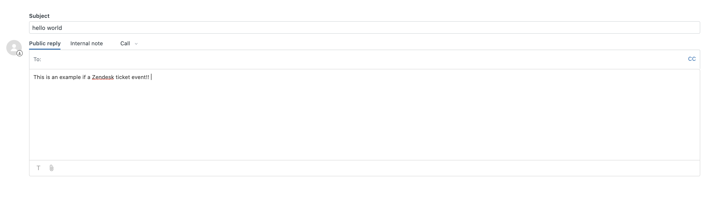

# Zendesk Source for Knative

The Zendesk Source enables integration of [Zendesk](https://www.zendesk.com/) events with Knative, allowing end-users the ablility to subscribe new `Ticket` events.

## Contents

- [Zendesk Source for Knative](#zendesk-source-for-knative)
  - [Contents](#contents)
  - [Building](#building)
  - [Deploy a Controller](#deploy-a-controller)
    - [Deploy a Zendesk Source Controller From Code](#deploy-a-zendesk-source-controller-from-code)
  - [Create Zendesk Integration](#create-zendesk-integration)
  - [Deploy a Zendesk Source](#deploy-a-zendesk-source)
    - [Verify a Zendesk Source Deployment](#verify-a-zendesk-source-deployment)
    - [Customizing the integration](#customizing-the-integration)
  - [Events](#events)
  - [Support](#support)

## Building

The entry point (`main` package) for the controller and target adapter are respectively under
`cmd/controller/` and `cmd/adapter/`. Both these programs can be built using
the Go toolchain from the `knative-sources/zendesk` directory:

```sh
$ make build
```

Binaries will be generated for your current OS and architecture inside the root repo `_output` thdirectory.

Those binaries can also be packaged as container images in order to run inside a Kubernetes cluster:


```sh
$ make image
```

To list the other 'make' functions:

```sh
$ make help
```

## Deploy a Controller

### Deploy a Zendesk Source Controller From Code

[ko](https://github.com/google/ko) provides a quick method to build from source and apply the associated Kuberneties configurations.

```sh
$ ko apply -f ./config/
```

Alternatively you can base on the manifests at the config repo to build a set of kubernetes manifests that use your customized images and namespace.

## Create Zendesk Integration

## Deploy a Zendesk Source

An instance of the Zendesk Source is created by applying a manifest that fullfills its CRD schema. Accepted Spec parameters are:

- `subdomain` for the Zendesk tenant being used.
- `email` associated with THE Zendesk account.
- `token` generated from Zendesk admin site for the integration.
- `webhookUsername` that will be used to verify event callbacks.
- `webhookPassword` that will be used to verify event callbacks.

All parameters are required.

Note that `webhookUsername` and `webhookPassword` are arbitrary values and will be used from zendesk to sign requests, and at the Zendesk source to verify them.

Example Secret Deployment:

```yaml
apiVersion: v1
kind: Secret
metadata:
  name: zendesksource
type: Opaque
stringData:
  token: 'tHpUJ2ieiXsxEvBotczR99EwpETeQOiUU07KovBJ'
  password: 'Pa$$sw0rd'
```

Example Source Deployment:

```yaml
apiVersion: sources.triggermesh.io/v1alpha1
kind: ZendeskSource
metadata:
  name: zendesksource
spec:
  email: coyote@acmeanvils.com
  subdomain: 'acmeanvils'
  token:
    secretKeyRef:
      name: zendesksource
      key: token
  webhookUsername: 'webhookuser'
  webhookPassword:
    secretKeyRef:
      name: zendesksource
      key: webhookPassword
  sink:
    ref:
      apiVersion: serving.knative.dev/v1
      kind: Service
      name: event-display

```

The example relies on an `event-display` service and on the `zendesksource` secret that should contains `token` and `webhookPassword` keys.

### Verify a Zendesk Source Deployment

- To verify a successful deployment of a Zendesk source instance navigate to the `settings` sidebar of your Zendesk subdomain and select `Extensions`:


- A Zendesk Source creates a new `Extension/Target` prefixed with: `io.triggermesh.`.


- The target is linked to a `Trigger` which can be found by navigating to the `settings` sidebar of your Zendesk subdomain and selecting `Triggers`.


- A `Trigger` is assigned the same name as the associated `Target`:


- Click on the source created `Trigger` to access the configured conditions and actions.


- At the bottom of the same page, the JSON payload that will be sent to the source can be found.


## Events

Here we can see the an example ticket being created on Zendesk:



The event that will was created by a `Zendesk Event Source` is as follows:

```txt
☁️  cloudevents.Event
Validation: valid
Context Attributes,
  specversion: 1.0
  type: com.zendesk.ticket
  source: tmdev2.zendesksource-zd-event-test
  subject: Hello world
  id: 132
  time: 2020-07-16T19:29:01.887525916Z
  datacontenttype: application/json
Data,
  {
    "account": "tm",
    "assignee_email": "jeffthenaef@gmail.com",
    "assignee_first_name": "jeff",
    "assignee_last_name": "naef",
    "assignee_name": "jeff naef",
    "brand_name": "tm",
    "cc_names": "",
    "ccs": "[]",
    "current_holiday_name": "Liquid error: internal",
    "current_user_details": "",
    "current_user_email": "jeffthenaef@gmail.com",
    "current_user_external_id": "",
    "current_user_first_name": "jeff",
    "current_user_language": "English",
    "current_user_name": "jeff naef",
    "current_user_notes": "",
    "current_user_organization_details": "",
    "current_user_organization_name": "tm",
    "current_user_organization_notes": "",
    "current_user_phone": "",
    "description": "----------------------------------------------\n\njeff naef, Jul 16, 2020, 4:28 PM\n\nThis is an example if a Zendesk ticket event!!",
    "due_date": "",
    "external_id": "",
    "group_name": "Support",
    "id": "132",
    "organization_details": "",
    "organization_external_id": "",
    "organization_name": "tm",
    "organization_notes": "",
    "priority": "",
    "requester_details": "",
    "requester_email": "jeffthenaef@gmail.com",
    "requester_external_id": "",
    "requester_field": "",
    "requester_first_name": "jeff",
    "requester_language": "English",
    "requester_last_name": "naef",
    "requester_name": "jeff naef",
    "requester_phone": "",
    "satisfaction_current_comment": "",
    "satisfaction_current_rating": "",
    "status": "Open",
    "tags": "",
    "ticket_field_id": "",
    "ticket_field_option_title_id": "",
    "ticket_type": "Ticket",
    "title": "Hello world",
    "url": "tmdev2.zendesk.com/agent/tickets/132",
    "via": "Web Form"
  }
```

## Support

This is heavily **Work In Progress** We would love your feedback on this
Operator so don't hesitate to let us know what is wrong and how we could improve
it, just file an [issue](https://github.com/triggermesh/knative-sources/issues/new)

