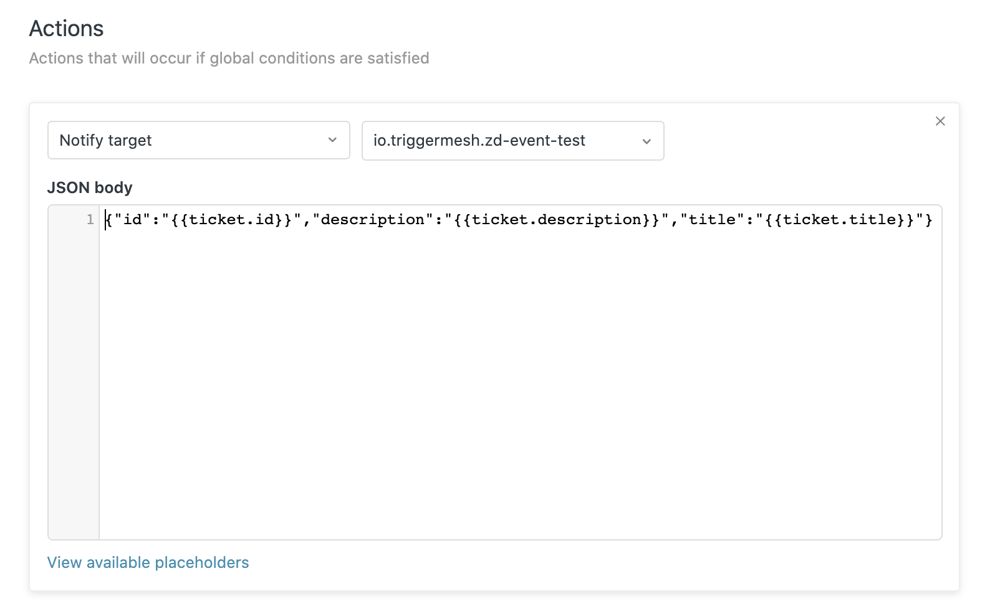

# Zendesk Source for Knative

The Zendesk Source enables integration of [Zendesk](https://www.zendesk.com/) events into a Knative/Kuberneties environment, allowing end-users the ablility to subscribe other Services/Functions to new `Ticket` events.

## Contents

- [Zendesk Source for Knative](#zendesk-source-for-knative)
  - [Contents](#contents)
  - [Building](#building)
  - [Deploy a Controller](#deploy-a-controller)
    - [Deploy a Zendesk Source Controller From Code](#deploy-a-zendesk-source-controller-from-code)
  - [Deploy Zendesk Source](#deploy-zendesk-source)
  - [Verify a Zendesk Source Deployment](#verify-a-zendesk-source-deployment)
  - [Events](#events)
  - [Support](#support)

## Building

**The entry point (`main` package) for the controller and target adapter are under `cmd/controller/` and `cmd/adapter/`, respectively. Both these programs can be built using the Go toolchain from the `knative-sources/zendesk` directory**

To create binaries for your current OS and architecture inside the root repo `_output` directory:

```sh
$ make build
```

To create container images:

```sh
$ make image
```

To list the other 'make' functions:

```sh
$ make help
```

## Deploy a Controller

### Deploy a Zendesk Source Controller From Code

[ko](https://github.com/google/ko) provides a quick method to build from source and apply the associated Kuberneties configurations.

```sh
$ ko apply -f ./config/
```

Alternatively you can base on the manifests at the config repo to build a set of kubernetes manifests that use your customized images and namespace.

## Deploy a Zendesk Source

**An instance of the Zendesk Source is created by applying a manifest that fullfills its CRD schema. Accepted and REQUIRED Spec parameters are:**

- `email` associated with a valid Zendesk account.
- `username` for basic authentication between Zendesk andthe    Source.
- `subdomain` for the Zendesk tenant.

**A Zendesk Source also REQUIRES that a secret `zendesksource` exists populated with a the following parameters:**

- `token`  for the Zendesk API.
- `password` for basic authentication between Zendesk and the Source

**Note that `username` and `password` are _defined_ here and can hold arbitrary values. They are not coming from or are populated by any external service. These two parameters will be used while registering the webhook and then passed to the Source to use in the validation process of the Webhook 'POST' requests.**

Example Secret Deployment:

```yaml
apiVersion: v1
kind: Secret
metadata:
  name: zendesksource
type: Opaque
stringData:
  token: 'tHpUJ2ieiXsxEvBotczR99EwpETeQOiUU07KovBJ'
  password: 'Pa$$sw0rd'
```

Example Source Deployment:

```yaml
apiVersion: sources.triggermesh.io/v1alpha1
kind: ZendeskSource
metadata:
  name: zendesksource
spec:
  email: 'joe@autoparts.com '
  username: 'joe'
  subdomain: 'autoparts'
  token:
            secretKeyRef:
              name: zendesksource
              key: token
  password:
            secretKeyRef:
              name: zendesksource
              key: password
  ref:
      apiVersion: serving.knative.dev/v1
      kind: Service
      name: event-display
```

Both of these files, along with an example source, exist in the `/zendesk/sample/` directory. After populating the required fields with valid information, and Deploy the Controller, a Zendesk Source can now be deployed by execuing the following command in the `knative-sources/zendesk` directory:

```sh
$ kubectl -n autoPartsNamespace apply -f sample/
```

Once created wait for the source to be ready and take note of the URL (`status.address.url`):

``` sh
$ kubectl get zendesksource -n autoPartsNamespace zendesk-source

NAME                READY   REASON   URL                                                              SINK                                                  AGE
zendesksource       True             https://zendesksource-triggermesh.autoPartsNamespace.dev.munu.io      http://event-display.autoPartsNamespace.svc.cluster.local    25h

```

### Verify a Zendesk Source Deployment

One can verify a successful deployment of a Zendesk Source by  navigate to the `settings` sidebar of your Zendesk subdomain and selecting `Extensions`


A Zendesk Source will create a new `Extension` or `Target` with a Title of : "io.triggermesh." + The namespace it was deployed + The deployment name. 

For the example deployment below we have a deployment with the name of `zendesksource` undert the namespace of `jeffthenaef`

After selecting 'edit' it can be seen that the Source has assigned its public `URL` address and the values for `username` and `password` that were passed into the Spec / Secret on creation are populated here.


A Zendesk Source also creates a Zendesk 'Trigger.' They can be found by  navigate to the `settings` sidebar of your Zendesk subdomain and selecting `Triggers`


A `Trigger` is assigned its title by the same naming convention as a `Target`


By 'double-clicking' the `Trigger` one is brought to the exanded section. Here we can see that the Source has created a Zendesk `Trigger` that will send notifications on the creation of a new Ticket to the `Extension` the Source Created.


In the lower section of this page the `Actions` section can be found. Here the actual payload is defined as to what information is sent to the Source when a `Ticket` is created.

Currently a Zendesk Source does not 'clean up' after itself and when It is destroyed the Zendesk 'Target' and 'Trigger'  will remain and will require manual cleanup.

**It is important to note that the `id` and `title` fields should be included as is in all requests but the user is free to modify this section and send any kind(s) of `Ticket` data to a Zendesk Source.**  



## Events

**Below you can find an example Cloudevent from a Zendesk Source.**

```sh
Validation: valid
Context Attributes,
  specversion: 1.0
  type: com.zendesk.new
  source: jeffthenaef.tmdev2.zendesksource-zd-event-test
  subject: AutoTicket
  id: 114
  time: 2020-07-14T22:31:42.772666553Z
  datacontenttype: application/json
Data,
  {
    "created_at": "Jul 14",
    "description": "----------------------------------------------\n\njeff naef, Jul 14, 2020, 7:31 PM\n\nYour auto parts are ready",
    "id": "114",
    "title": "AutoTicket"
  }
```

## Support

This is heavily **Work In Progress** We would love your feedback on this
Operator so don't hesitate to let us know what is wrong and how we could improve
it, just file an [issue](https://github.com/triggermesh/knative-sources/issues/new)

